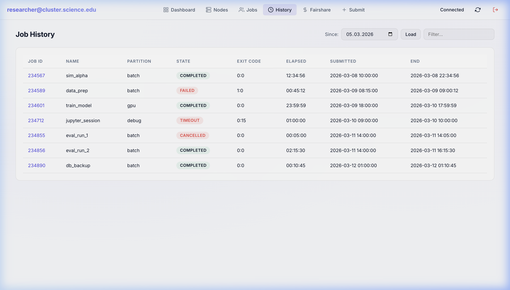
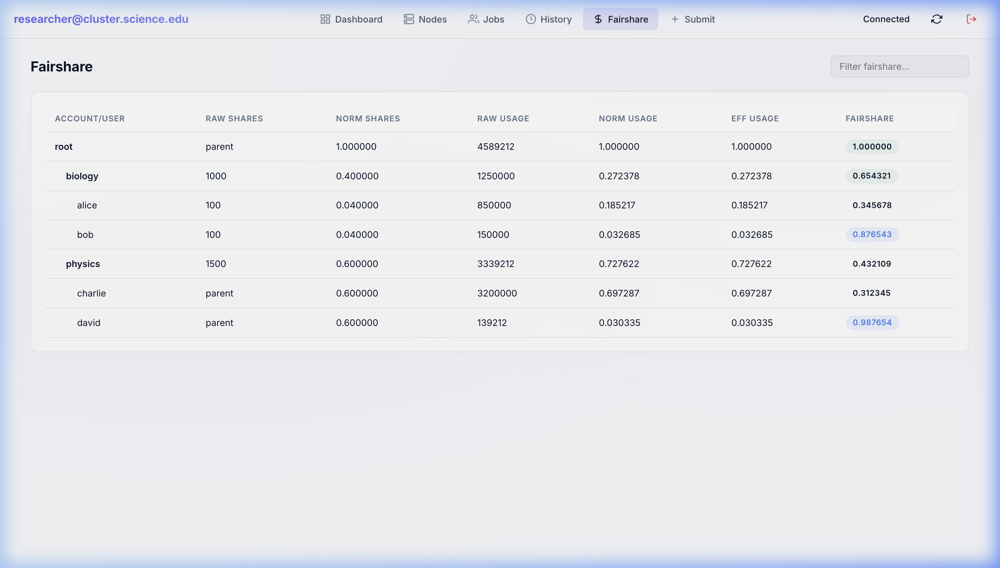

# Slurm Manager

A web-based Slurm cluster management UI that connects via SSH and provides real-time monitoring and job control.


## Screenshots

| | |
|:---:|:---:|
|  |  |
| **SSH Connection** | **Dashboard** |
|  |  |
| **Nodes** | **Submit Job** |
|  |  |
| **Job History** | **Fairshare** |

## Features

- **Dashboard** — Cluster overview with node state distribution, partition info, job stats, and your fairshare score
- **Nodes** — Per-node list with state, CPUs, memory, GRES, and CPU load (click any node for details)
- **Jobs** — Full cluster queue with filtering and sorting. Also shows your job queue with cancel, hold, release, view output, and detail actions.
- **Job History** — Past job accounting via `sacct` with configurable date range
- **Fairshare** — View fairshare scores for all accounts/users with color-coded values
- **Submit Job** — Script editor with quick templates (Basic, GPU, Array, MPI)
- **Job Output** — View stdout/stderr logs from job output files
- **Auto-refresh** — Data refreshes every 10 seconds while connected
- **Reconnect** — Automatic disconnect detection with reconnect prompt
- **Remember Me** — Saves connection info to localStorage for quick reconnects
- **Theme** — Light/Dark theme toggle

## Installation

Download the latest release for your platform from [GitHub Releases](../../releases):

If you are on Mac OS (arm64 Apple Silicon):
```bash
tar -xzf slurmmanager-*-darwin-arm64.tar.gz
cd slurmmanager-*-darwin-arm64
```

If you are on Linux (x64):
```bash
tar -xzf slurmmanager-*-linux-x64.tar.gz
cd slurmmanager-*-linux-x64
```

Then launch the app:
```bash
./slurmmanager
```

Options:
```bash
./slurmmanager --port 8080   # Custom port (default: 3000)
./slurmmanager --help        # Show all options
```

> **Requires** Node.js ≥ 16 installed on the system.

## Development

```bash
git clone https://github.com/paulgavrikov/slurmmanager.git
cd slurmmanager
npm install
npm run dev
```

Open [http://localhost:3000](http://localhost:3000) and enter your cluster's SSH details.

## SSH Authentication

The app supports three authentication methods (in order of priority):

1. **Private key (pasted)** — Paste your key text into the "Private Key" field
2. **Password** — Enter your password in the "Password" field
3. **Auto-detect** — Leave both empty and the server will automatically try keys from `~/.ssh/` (`id_ed25519`, `id_rsa`, `id_ecdsa`, `id_dsa`), then fall back to SSH agent

## Requirements

- **Node.js** ≥ 16
- SSH access to a Slurm cluster

## Environment

| Variable | Default | Description |
|----------|---------|-------------|
| `PORT` | `3000` | Server port |
| `SSH_AUTH_SOCK` | (system) | SSH agent socket (used as fallback) |

## Stack

- **Backend**: Node.js, Express, [ssh2](https://github.com/mscdex/ssh2), [ws](https://github.com/websockets/ws)
- **Frontend**: Vanilla HTML/CSS/JS with WebSocket
